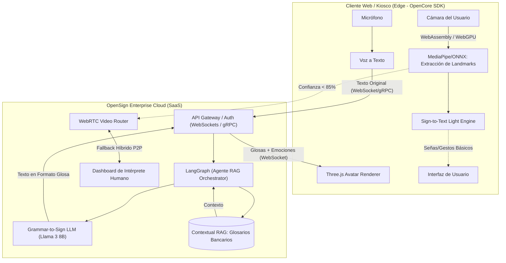

# OpenSign Enterprise - Arquitectura de OpenCore y SaaS

Diseño y plan de ejecución para la plataforma de infraestructura de accesibilidad empresarial basada en IA para personas sordas. Este plan detalla la separación de componentes entre el núcleo de código abierto (OpenCore) y la plataforma en la nube de pago (SaaS), definiendo las tecnologías clave a utilizar.

---

## 1. Visión Arquitectónica (Edge + Cloud)

Para resolver los problemas de latencia, privacidad y precisión, OpenSign utilizará una arquitectura híbrida: procesamiento ligero en el cliente (Edge) para la visión y procesamiento semántico profundo en la nube (SaaS) para la traducción.



## 2. Estructura OpenCore vs. SaaS

### OpenCore (Código Abierto)
El motor de ejecución local y los SDKs de integración. Permite a cualquier desarrollador incorporar accesibilidad básica en sus proyectos sin depender de servicios pagos.

*   **OpenSign Client SDK (`@opensign/sdk`)**:
    *   Librería en TypeScript para navegadores y entornos híbridos (React Native / Capacitor).
    *   **Procesamiento Edge Vision**: Modelos optimizados (Wasm/WebGPU) para extraer puntos clave corporales sin enviar video a la nube, garantizando privacidad (HIPAA compliance).
    *   **Web Components**: Componentes UI listos para usar como `<opensign-avatar>`, `<opensign-kiosk>`, `<opensign-chat>`.
*   **Sign-to-Text Light Engine (Local)**:
    *   Modelo de visión ligero que infiere señas básicas directamente en el cliente (ej. gestos de control como "Sí", "No", "Ayuda", "Repetir").
*   **Avatar Animator Core**:
    *   Motor liviano de renderizado en Three.js/WebGL para animar avatares 3D basados en *morph targets* (expresiones faciales no manuales) y animaciones esqueléticas.
*   **Grammar-to-Sign Engine (Local)**:
    *   Motor de reescritura de texto a Glosas. Para evitar código espagueti propio de las reglas deterministas, usaremos un **LLM ligero cuantizado (Llama 3 8B vía llama.cpp)**. Se encargará de traducir el lenguaje natural a la gramática de la **LSA (Lengua de Señas Argentina)**, priorizada para el MVP.

### SaaS/Enterprise Cloud (Servicios Comerciales de Pago)
Servicios listos para producción empresarial con alta disponibilidad, seguridad, modelos avanzados y soporte operativo especializado.

*   **Protocolos de Comunicación de Baja Latencia**:
    *   La comunicación entre el cliente Edge y el Gateway del SaaS para la traducción en tiempo real se realizará preferentemente mediante **WebSockets** o **gRPC/WebRTC data channels** para garantizar baja latencia bidireccional. Las llamadas REST quedarán reservadas para las operaciones CRUD del dashboard.
*   **Enterprise Grammar-to-Sign API con Contextual RAG (Orquestado por LangGraph)**:
    *   El dominio de prueba inicial será el **Sector Bancario**, el cual posee procesos estandarizados, dolor financiero claro, y jerga de fácil integración en MVP (evitando la sobrerregulación de datos médicos temprana).
    *   El flujo del RAG y la toma de decisiones en el backend (ej. decidir si buscar en el manual del banco o responder directamente) se orquestará utilizando arquitecturas de grafos/agentes con **LangGraph** para mantener un control estricto sobre las alucinaciones.
*   **Human-in-the-loop Platform (Fallback Remoto)**:
    *   El "plan de escape" seguro. Si el modelo de IA local detecta que su nivel de confianza es menor al 85%, el SDK conmuta transparentemente a una videollamada WebRTC (LiveKit) con un intérprete humano certificado.
*   **RLHF Portal (Validación Comunitaria)**:
    *   Plataforma de anotación impulsada por la comunidad para re-entrenar los modelos, generando el aval ético y precisión comunitaria.

---

## 3. Experiencia del Desarrollador (Ejemplo de Integración SDK)

Ejemplo de cómo un banco integraría el Avatar en su página web conectándose por WebSockets:

```html
<!-- Cargar el SDK desde un CDN o vía NPM -->
<script type="module" src="https://cdn.opensign.ai/sdk/v1/core.js"></script>

<!-- Componente Web nativo con configuración Enterprise -->
<opensign-avatar 
    api-key="ent_banco_xyz123" 
    language="LSA" 
    transport="websocket"
    rag-context="atencion_cliente_banco"
    fallback-human="true">
</opensign-avatar>

<script>
  const avatar = document.querySelector('opensign-avatar');
  
  // Enviar texto para traducir semánticamente (con jerga bancaria del RAG) y animar
  avatar.translateAndSign("Hola, bienvenido al banco. ¿Desea hacer un depósito a plazo fijo?");
</script>
```

---

## 4. Tecnologías Propuestas (Stack MVP Actualizado)

*   **Toolchain del Monorepo**: **Turborepo** y **pnpm**.
*   **Frontend Kiosco (`apps/kiosk-web`)**: **Next.js 14 App Router**, TypeScript, TailwindCSS.
*   **Backend API en Tiempo Real (`apps/api-core`)**: **NestJS** + **Socket.io** (`@nestjs/websockets`). Toda la API de negocio y el gateway WebSocket se escriben en TypeScript.
*   **Librerías Compartidas (`packages/`)**:
    *   `@opensign/shared-types`: DTOs e interfaces puramente en TypeScript, decorados con `class-validator` y `class-transformer` para validación automática en NestJS WebSockets.
    *   `@opensign/ui`: Componentes React compartidos.
*   **Procesamiento de IA/Visión (`apps/ai-core`)**: **Python** (FastAPI/ONNX/MediaPipe). Solo las operaciones de inferencia pesadas o modelos que no corren en el navegador permanecen en Python. El frontend no se comunica directamente con este servicio; lo hace a través de `api-core`.
*   **Comunicación `api-core ↔ ai-core`**: **gRPC** para baja latencia interna.
*   **Infraestructura SaaS (Cloud)**: LangGraph, Qdrant / Pgvector, Supabase, LiveKit, Kubernetes.

---

## 5. Estructura de Carpetas (Monorepo Turborepo)

```text
opensign-enterprise/
├── apps/
│   ├── kiosk-web/            # Next.js 14 App Router (Kiosco bancario Edge)
│   │   ├── app/
│   │   ├── components/
│   │   ├── hooks/
│   │   ├── lib/
│   │   ├── next.config.js
│   │   ├── tailwind.config.ts
│   │   └── package.json
│   ├── api-core/             # NestJS + Socket.io (Gateway tiempo real)
│   │   ├── src/
│   │   │   ├── main.ts
│   │   │   ├── app.module.ts
│   │   │   ├── sign/
│   │   │   │   ├── sign.gateway.ts
│   │   │   │   ├── sign.module.ts
│   │   │   │   └── sign.service.ts
│   │   │   └── ai/
│   │   │       ├── ai.service.ts
│   │   │       └── ai-client.ts
│   │   ├── nest-cli.json
│   │   └── package.json
│   └── ai-core/              # Python: Inferencia pesada/Modelos
│       ├── src/
│       ├── protos/
│       ├── requirements.txt
│       └── package.json
├── packages/
│   ├── shared-types/         # DTOs TS con class-validator/class-transformer
│   │   ├── src/
│   │   │   ├── sign/
│   │   │   │   ├── landmark.dto.ts
│   │   │   │   └── interpretation.dto.ts
│   │   │   └── websocket/
│   │   │       └── events.enum.ts
│   │   ├── package.json
│   │   └── tsconfig.json
│   └── ui/                   # Componentes React compartidos
│       ├── src/
│       ├── package.json
│       └── tsconfig.json
├── package.json
├── pnpm-workspace.yaml
├── turbo.json
└── .npmrc
```

---

## User Review Required

> [!IMPORTANT]
> **Privacidad por Diseño (Compliance)**: El procesamiento de visión local (Edge-based tracking) es nuestra mayor ventaja legal. El SDK procesará las imágenes en el cliente y solo enviará metadatos numéricos (landmarks), favoreciendo el cumplimiento de privacidad en instituciones bancarias.

> [!WARNING]
> **El "Uncanny Valley" y las Expresiones No Manuales**: En la LSA, la gesticulación facial define el tono gramatical. Para evitar que el avatar parezca rígido, el motor en Three.js deberá exagerar estas expresiones. Se diseñará un **avatar estilizado (estilo Pixar/Cartoon)** para evadir el "uncanny valley".

---

## Siguientes Pasos

1. Reemplazar la estructura actual del monorepo con Next.js + NestJS + shared-types + ui.
2. Configurar `pnpm`, `turbo.json` y workspaces.
3. Implementar `packages/shared-types` con DTOs validables compartidos.
4. Crear `apps/kiosk-web` y `apps/api-core` conectados por Socket.io.
5. Dejar un `apps/ai-core` Python listo para gRPC como placeholder de inferencia.
